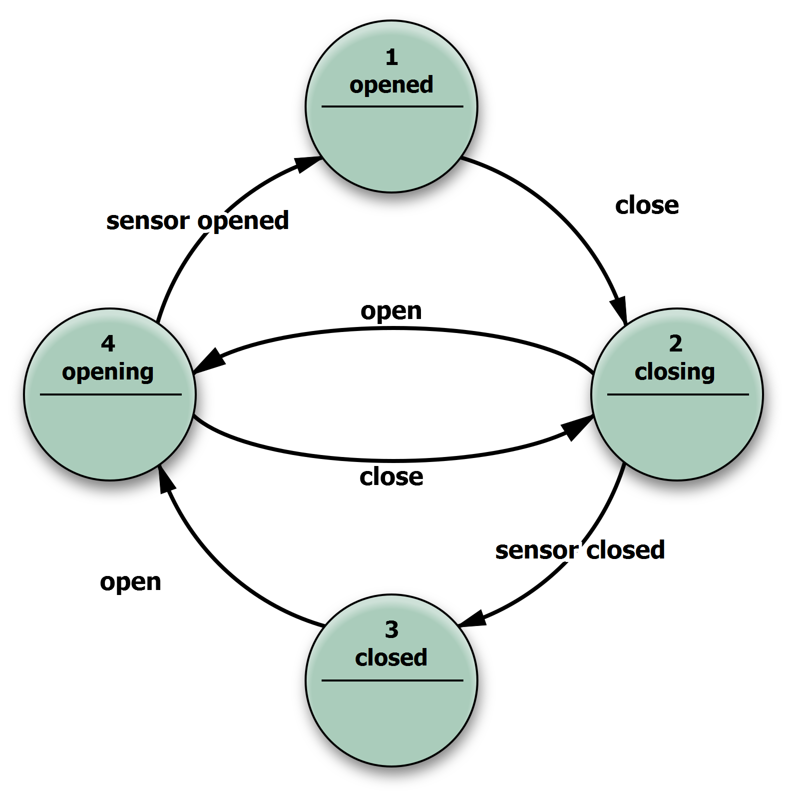

# LevelUp.StateMachine

## Install

### Package Manager

    Install-Package LevelUp.StateMachine -Version 2.0.1

### .NET CLI

    dotnet add package LevelUp.StateMachine --version 2.0.1

### PackageReference

    <PackageReference Include="LevelUp.StateMachine" Version="2.0.1" />

### Packet CLI

    paket add LevelUp.StateMachine --version 2.0.1


## Tutorial

### Instance StateMachine

```C#
// Instance StateMachine
var stateMachine = new StateMachine<StateType, CommandType>();
```


<br>

```C#
var translations = new Dictionary<(StateType, CommandType), StateType>
{
    {(StateType.State1, CommandType.Command1), StateType.State2},
    {(StateType.State2, CommandType.Command2), StateType.State3}
};

// Instance StateMachine
var stateMachine = new StateMachine<StateType, CommandType>(translations);
```


<br>

```C#
var translations = new Dictionary<StateType, StateType>
{
    {StateType.State1, StateType.State2},
    {StateType.State2, StateType.State3}
};

// Instance StateMachine
var stateMachine = new StateMachine<StateType>(translations);
```


<br>

```C#
public class MyStateMachine : StateMachine<StateType, CommandType>
{
    public MyStateMachine()
    {
        this.Translations = new Dictionary<(StateType, CommandType), StateType>
        {
            {(StateType.State1, CommandType.Command1), StateType.State2},
            {(StateType.State2, CommandType.Command2), StateType.State3}
        };
    }
}

// Instance StateMachine
var stateMachine = new MyStateMachine();
```

### Add translations

```C#
stateMachine
    .AddTranslation(StateType.State1, CommandType.Command1, StateType.State2)
    .AddTranslation(StateType.State2, CommandType.Command2, StateType.State3);
```


<br>

```C#
stateMachine
    .AddTranslation(StateType.State1, StateType.State2)
    .AddTranslation(StateType.State2, StateType.State3);
```

### Init StateData

```C#
// Init StateData
var stateData = new StateData<StateType>(StateType.State1);
```


### Trigger transaction

```C#
// Trigger transaction
stateMachine.Trigger(stateData, CommandType.Command1);
```

### Translate to target state

```C#
// Translate to target state
stateMachine.TranslateTo(stateData, StateType.State3);
```

### Read current state

```C#
// Read current state
var state = stateData.State;
```


<br>

```C#
// Read current state
var state = stateMachine.Trigger(stateData, CommandType.Command1).State;
```


<br>

```C#
// Read current state
var state = stateMachine.TranslateTo(stateData, StateType.State3).State; 
```

### Check transaction

```C#
// Check transaction
var hasTranslation = stateMachine.HasTranslation(sourceState, command);
```

<br>

```C#
// Check transaction
var hasTranslation = stateMachine.HasTranslation(sourceState, targetState);
```

### Event handling

```C#
stateMachine.CommandTrigger += (sender, e) => { 
    Console.WriteLine("CommandTrigger..."); 
};

stateMachine.StateChanging += (sender, e) => { 
    Console.WriteLine("StateChanging..."); 
};

stateMachine.StateChanged += (sender, e) => { 
    Console.WriteLine("StateChanged..."); 
};
```

## Example



```C#
public class MyStateMachine : StateMachine<StateType, CommandType>
{
    public MyStateMachine()
    {
        this.Translations = new Dictionary<(StateType, CommandType), StateType>
        {
            {(StateType.Opening, CommandType.SensorOpened), StateType.Opened},
            {(StateType.Opening, CommandType.Close), StateType.Closing},
            {(StateType.Opened, CommandType.Close), StateType.Closing},
            {(StateType.Closing, CommandType.Open), StateType.Opening},
            {(StateType.Closing, CommandType.SensorClosed), StateType.Closed},
            {(StateType.Closing, CommandType.SensorClosed), StateType.Closed},
            {(StateType.Closed, CommandType.Open), StateType.Opening}
        };
    }
}

// Instance StateMachine
var stateMachine = new MyStateMachine();

// Hook event
stateMachine.CommandTrigger += (sender, e) => { 
    Console.WriteLine(e.StateData.State); 
};

stateMachine.StateChanging += (sender, e) => { 
    Console.WriteLine(e.StateData.State); 
};

stateMachine.StateChanged += (sender, e) => { 
    Console.WriteLine(e.StateData.State); 
};

// Init StateData
var stateData = new StateData<StateType>(StateType.Opening);

// Trigger transaction
stateMachine.Trigger(stateData, StateType.Opened);
stateMachine.Trigger(stateData, StateType.Opening);
stateMachine.Trigger(stateData, StateType.Closing);
stateMachine.Trigger(stateData, StateType.Closed);

// Translate to target state
stateMachine.TranslateTo(stateData, CommandType.SensorOpened);
stateMachine.TranslateTo(stateData, CommandType.Open);
stateMachine.TranslateTo(stateData, CommandType.Close);
stateMachine.TranslateTo(stateData, CommandType.SensorClosed);
stateMachine.TranslateTo(stateData, CommandType.Open);
```
